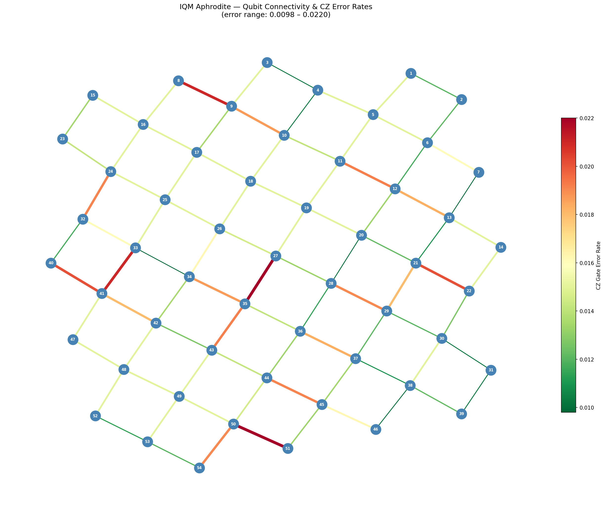
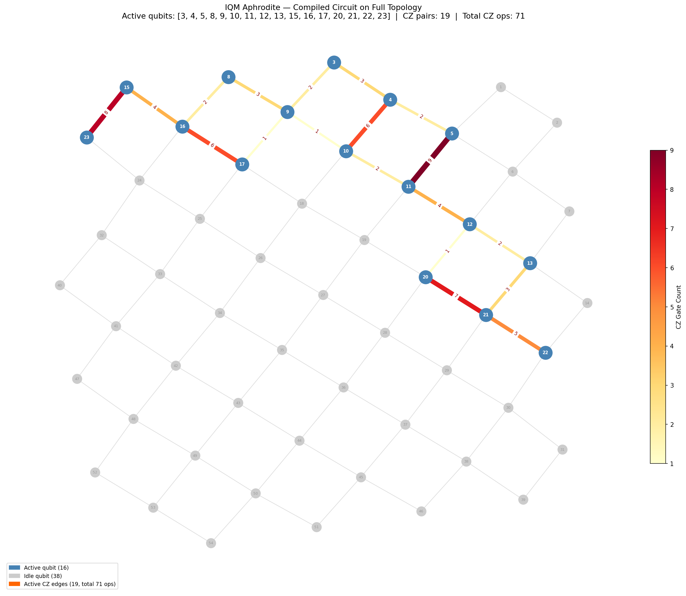

# QProv Data Visualisation Examples

A collection of quantum circuit provenance tools demonstrating how to run, transpile, and visualise quantum circuits on the [IQM Aphrodite](https://www.iqmquantum.com/) 54-qubit fake backend using Qiskit and MLflow.

## Overview

The project contains three scripts:

| Script | Description |
|--------|-------------|
| `hw_visualisation.py` | Builds and runs a 15-qubit entangling circuit on the IQM Aphrodite fake backend, collects provenance data (gate counts, error profiles, T1/T2 times, qubit layout), and logs everything to MLflow |
| `backend_viz.py` | Visualises the full 54-qubit Aphrodite topology with edges coloured by CZ gate error rate |
| `circuit_viz.py` | Overlays the compiled circuit onto the full topology, highlighting active qubits and CZ gate counts per connection |

## Example Outputs

### Backend Topology — CZ Error Rates
Full 54-qubit connectivity graph with edge colour indicating two-qubit gate error rate (green = low, red = high).



---

### Compiled Circuit on Backend Topology
Active qubits (blue) and CZ gate activity (yellow → red by count) overlaid on the full backend topology. Grey nodes and edges are idle during circuit execution.



---

## Setup

### Local (Python venv)

```bash
python3 -m venv .venv
source .venv/bin/activate
pip install -r requirements.txt
```

### Docker

```bash
docker build -t qprov-viz .
docker run --rm -v $(pwd):/app/output qprov-viz
```

## Usage

Run the main script to execute the circuit, collect provenance, and write `qcprov.json`:

```bash
python hw_visualisation.py
```

Then generate the visualisations:

```bash
python backend_viz.py    # saves backend_connectivity.png
python circuit_viz.py    # saves circuit_topology.png
```

MLflow logs are stored in `./mlruns/`. View them with:

```bash
mlflow ui
```

## Circuit Description

`hw_visualisation.py` builds a 15-qubit circuit with the following structure:

1. **State preparation** — Hadamard + Rz(π/(i+2)) on all qubits, X on every 3rd qubit
2. **CX forward ladder** — `cx(0→1), cx(1→2), ..., cx(13→14)` + Ry rotations
3. **Skip-1 CX layer** — `cx(0→2), cx(2→4), ..., cx(12→14)` + Rz rotations
4. **CZ on odd pairs** — `cz(1,2), cz(3,4), ..., cz(13,14)` + Rx rotations
5. **CX reverse ladder** — `cx(14→13), ..., cx(1→0)` + final H+Rz layer

The circuit is transpiled to the IQM native gate set (`prx`, `cz`) at optimisation level 2.

## Provenance Data

After running, `qcprov.json` contains:

- Backend name and qubit count
- T1 / T2 coherence times per qubit
- Qubit connectivity graph
- Gate set and gate times
- Single- and two-qubit gate error rates
- Readout fidelities per qubit
- Original and compiled circuit QASM
- Physical qubit layout from transpiler

## Requirements

- Python 3.11
- `qiskit==1.2.4`
- `qiskit-aer==0.15.1`
- `qiskit-iqm==17.8`
- `mlflow==3.10.1`
- `matplotlib`, `networkx`, `numpy`
